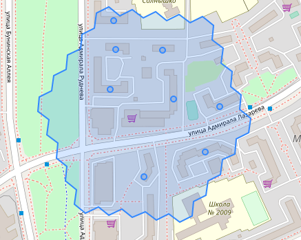
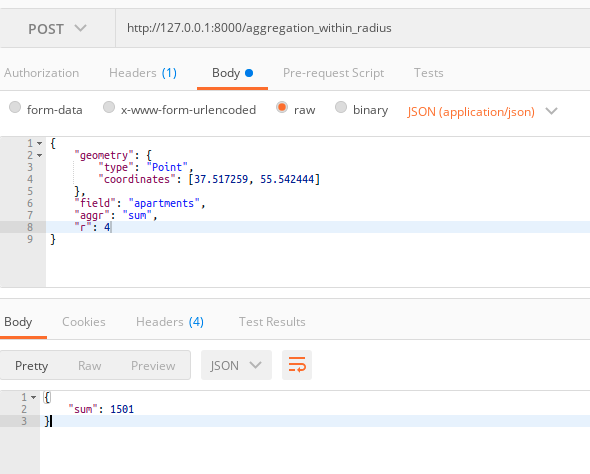
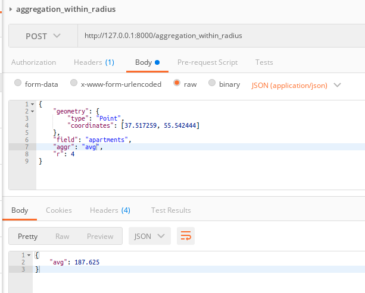
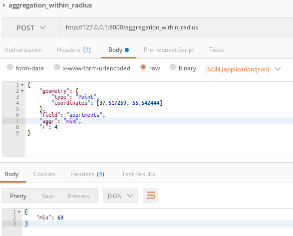
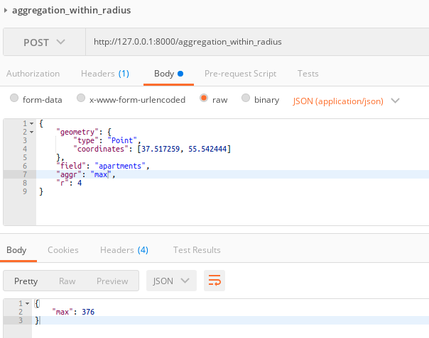
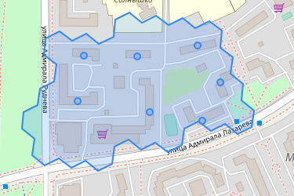
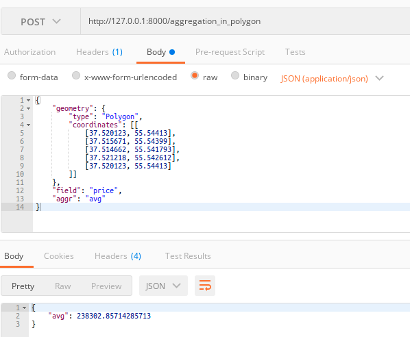

# Тестовое задание "Begemotic MVP"

Cервис расчета геофакторов по HTTP API. MVP сервиса: расчет некоторых видов геоагрегаций на одном датасете —
сэмпле многоквартирных домов Москвы (см. apartments.csv)

## Комментарий

Можно было решить поставленную задачу без использования Postgis, и хранить в базе вместе с домами их id гексов h3. Но это же не интересно)

## Запуск

```docker-compose up -d --build```

## API

### API documentation (provided by Swagger UI)

```http://127.0.0.1:8000/docs```

### POST /aggregation_within_radius

Посчитать агрегацию в радиусе k гексов от точки

#### Request body

```
{
  "geometry": {
    "coordinates": [double, double],
    "type": "Point"
  },
  "field": string
            Enum: "apartments" "price" "year",
  "aggr": string
            Enum: "sum" "avg" "min" "max",
  "r": integer > 0
}
```

#### Example of use



| id   | apartments | price  | year |
|------|------------|--------|------|
| 1271 | 132        | 253490 | 2001 |
| 1272 | 175        | 250847 | 2001 |
| 1273 | 69         | 223698 | 2000 |
| 1274 | 95         | 183780 | 2000 |
| 1275 | 263        | 223536 | 2000 |
| 1276 | 169        | 293412 | 2001 |
| 1279 | 376        | 228855 | 2003 |
| 1280 | 222        | 250356 | 2003 |









### POST /aggregation_in_polygon

Посчитать агрегацию в заданном полигоне, полигон должен аппроксимироваться с помощью гексов

#### Request body

```
{
  "geometry": {
    "coordinates": [[
        [double, double],
        [double, double],
        [double, double],
        ...
    ]],
    "type": "Point"
  },
  "field": string
            Enum: "apartments" "price" "year",
  "aggr": string
            Enum: "sum" "avg" "min" "max"
}
```

#### Example of use



| "id" | "apartments" | "price" | "year" |
|------|--------------|---------|--------|
| 1152 | 100          | 227321  | 2001   |
| 1153 | 142          | 265526  | 2000   |
| 1272 | 175          | 250847  | 2001   |
| 1273 | 69           | 223698  | 2000   |
| 1274 | 95           | 183780  | 2000   |
| 1275 | 263          | 223536  | 2000   |
| 1276 | 169          | 293412  | 2001   |


